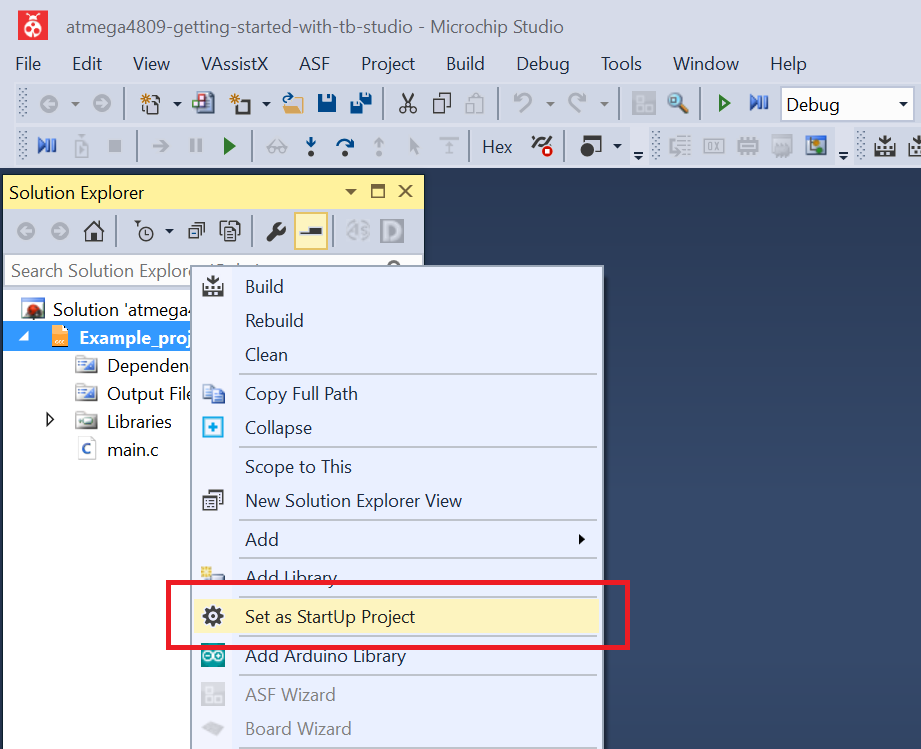
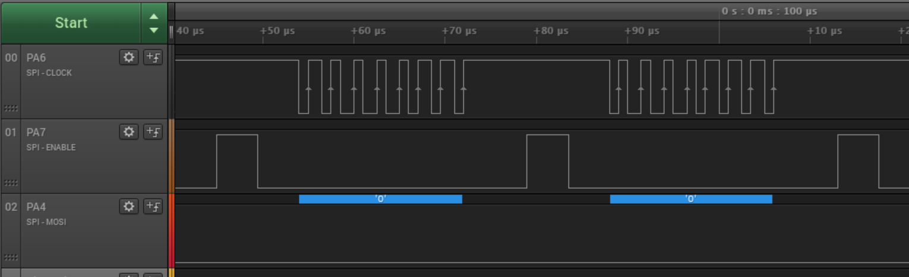

 # Changing Data Transfer Type

This example shows how to configure the device in SPI Host mode, control a client and send dummy data (value 0) with respect to the clock polarity and the clock phase, in data mode 3.

## Related Documentation
More details and code examples on the ATMEGA4809 can be found at the following links:
- [TB3215-Getting Started with Serial Peripheral Interface (SPI)](https://ww1.microchip.com/downloads/en/AppNotes/TB3215-Getting-Started-with-SPI-90003215A.pdf)
- [ATMEGA4809 Product Page](https://www.microchip.com/wwwproducts/en/ATMEGA4809)
- [ATMEGA4809 Code Examples on GitHub](https://github.com/microchip-pic-avr-examples?q=atmega4809)
- [ATMEGA4809 Project Examples in START](https://start.atmel.com/#examples/ATMEGA4809XplainedPro)

## Software Used
- Microchip Studio 7.0.2542 or newer [(https://www.microchip.com/mplab/microchip-studio)](https://www.microchip.com/mplab/microchip-studio)
- ATmega_DFP 1.6.364 or newer Device Pack

## Hardware Used
- ATMEGA4809 Xplained Pro [(ATMEGA4809-XPRO)](https://www.microchip.com/developmenttools/ProductDetails/ATMEGA4809-XPRO)

## Setup
The ATMEGA4809 Xplained Pro Development Board is used as test platform.

 

The following configurations must be made for this project:

- System clock is configured at 3.33 MHz
- SPI
  - SPI clock configured at 416 kHz (System Clock divided by 16 and Double Speed clock enabled)
  - SPI in Host mode
  - Data mode 3
  - LSB transmitted first
  - SCK - PA6, SS - PA7, MOSI - PA4, MISO - PA5

|Pin                       | Configuration      |
| :---------------------:  | :----------------: |
|         PA4 (MOSI) 	   |   Digital output   |
|         PA5 (MISO) 	   |   Digital input    |
|         PA6 (SCK) 	   |   Digital output   |
|         PA7 (SS) 	       |   Digital output   |

 ## Operation
 1. Connect the board to the PC.

 2. Open the **atmega4809-getting-started-with-spi-studio.atsln** solution in Microchip Studio.

 3. Set the **Changing_Data_Transfer_Type** project as StartUp project. Right click on the project in the **Solution Explorer** tab and click **Set as StartUp Project**.

 

 4. Build the **Changing_Data_Transfer_Type** project: right click on the **atmega4809-getting-started-with-spi-studio** solution and select **Build Solution**.

 

 5. Select the **ATMEGA4809 Xplained Pro** in the Connected Hardware Tool section of the project settings:
   - Right click on the project and click **Properties**;
   - Click on the **Tool** tab.
   - Select the **ATMEGA4809 Xplained Pro** (click on the **SN**) in the Selected debugger/programmer section, and save (CTRL + S):

 

 6. Program the project to the board: click on the **Debug** tab and click **Start Without Debugging**.

 

## Demo

The image below shows the SCK (PA6), SS (PA7) and MOSI (PA4) signals captured by a logic analyzer. Every time the client is selected (SS line low), the device outputs the SCK signal and sends `0x00` through MOSI line, in data mode 3.
 

## Summary

This example shows how to configure the device in SPI Host mode, control a client and send dummy data (value 0) in data mode 3.
