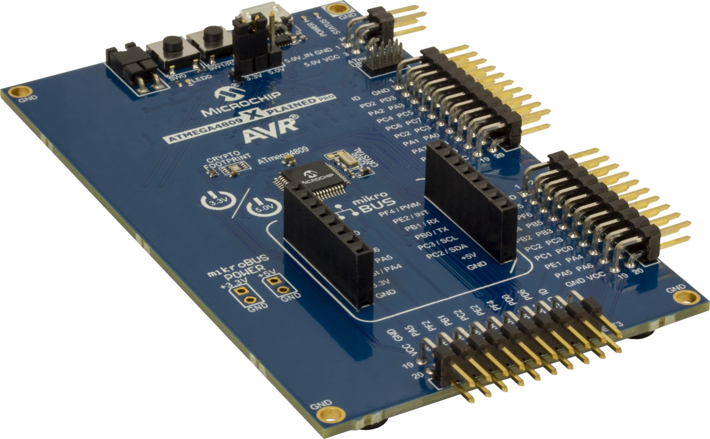
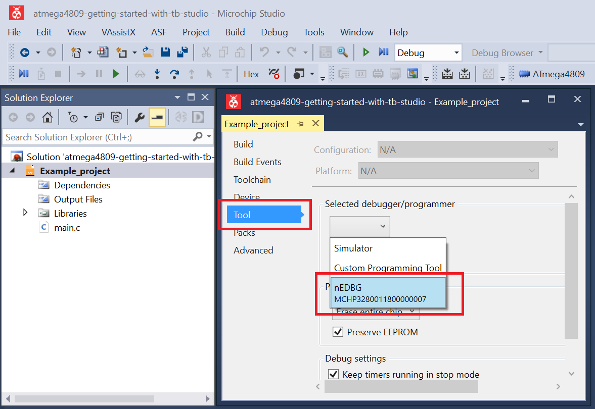

 # Receiving Data as Client

This example shows a basic initialization and setup for an SPI client device. To demonstrate this application functionality, an SPI host device will be used to transmit data to the SPI client. Data are received and read using the SPI interrupt.

## Related Documentation
More details and code examples on the ATMEGA4809 can be found at the following links:
- [TB3215-Getting Started with Serial Peripheral Interface (SPI)](https://ww1.microchip.com/downloads/en/AppNotes/TB3215-Getting-Started-with-SPI-90003215A.pdf)
- [ATMEGA4809 Product Page](https://www.microchip.com/wwwproducts/en/ATMEGA4809)
- [ATMEGA4809 Code Examples on GitHub](https://github.com/microchip-pic-avr-examples?q=atmega4809)
- [ATMEGA4809 Project Examples in START](https://start.atmel.com/#examples/ATMEGA4809XplainedPro)

## Software Used
- Microchip Studio 7.0.2542 or newer [(https://www.microchip.com/mplab/microchip-studio)](https://www.microchip.com/mplab/microchip-studio)
- ATmega_DFP 1.6.364 or newer Device Pack

## Hardware Used
- ATMEGA4809 Xplained Pro [(ATMEGA4809-XPRO)](https://www.microchip.com/developmenttools/ProductDetails/ATMEGA4809-XPRO)

## Setup
The ATMEGA4809 Xplained Pro Development Board is used as test platform.

 

The following configurations must be made for this project:

- System clock is configured at 3.33 MHz
- SPI
  - SPI clock configured at 416 kHz
  - SPI in Client mode
  - Data mode 0
  - LSB transmitted first
  - SCK - PA6, SS - PA7, MOSI - PA4, MISO - PA5

|Pin                       | Configuration      |
| :---------------------:  | :----------------: |
|         PA4 (MOSI)       |   Digital input    |
|         PA5 (MISO)       |   Digital output   |
|         PA6 (SCK)        |   Digital input    |
|         PA7 (SS)         |   Digital input    |

 ## Operation
 1. Connect the board to the PC.

 2. Open the **atmega4809-getting-started-with-spi-studio.atsln** solution in Microchip Studio.

 3. Set the **Receiving_Data_as_Client** project as StartUp project. Right click on the project in the **Solution Explorer** tab and click **Set as StartUp Project**.

 

 4. Build the **Receiving_Data_as_Client** project: right click on the **atmega4809-getting-started-with-spi-studio** solution and select **Build Solution**.

 

 5. Select the **ATMEGA4809 Xplained Pro** in the Connected Hardware Tool section of the project settings:
   - Right click on the project and click **Properties**;
   - Click on the **Tool** tab.
   - Select the **ATMEGA4809 Xplained Pro** (click on the **SN**) in the Selected debugger/programmer section, and save (CTRL + S):

 

 6. Program the project to the board: click on the **Debug** tab and click **Start Without Debugging**.

 

## Demo

To demonstrate this code example functionality, a breakpoint must be enabled inside the interrupt service routine of the SPI interrupt, as presented below. 

 

Then, click the **Debug** tab and click **Start Debugging and Break**, as presented in the image below. After starting the debugging session, the `receiveData` variable will be added to the **Watch** tab. 

 

To test the receive functionality, an SPI host device was used to transmit data. The transmitted data format is: `0`, `1`, `2`, `3`, `4`, etc. A short demo is available below.

 

## Summary

This example illustrated how to configure the device in SPI Client mode, and receive data using the SPI interrupt.
